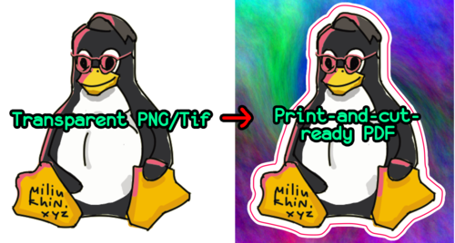

# stixy - create ready-to-print stickers from images.



This script lets you easily prepare stickers and stickerpacks for printing and cutting.
Just give it an image with a transparent background and it will create a PDF with both printable sticker graphics and contours for the cutting plotter which you can send directly to the printing company.

## Install
### Dependencies
The script requires:
* cairosvg
* potrace
* imagemagick
* python-pymupdf (for pdflayers python script)

To install on Arch Linux:
```
pacman -S python-cairosvg python-pymupdf potrace imagemagick
```

### stixy itself
```
sudo make install
```

## Usage

Let's say you have a PNG image with your stickerpack layout or just an image you want to make a sticker of.
Just run on your image:
```
stixy -i img.png
```
Stixy will generate the background (although you can provide one, see more options) and do all the contours. It also scales the output pdf to 300 dpi, so if you make an A5 300 DPI (1754x2480 pixels) sheet in your graphics editor and run stixy on it, output PDF's dimensions will correspond to the real-world dimensions of the sheet. Although you can adjust width however you want (see more options).

For individual stickers you might find useful changing the margin to account for growing white strokes, and disabling inner stroke if your sticker image already contains one:
```
stixy -i linuxtorvalds.png -m 50 -I 0
```

More options:
```
  -i  input image (required, has to store transparency info, e.g. png, tif)
  -o  output pdf file name/path
  -I  inner stroke (default = 38)
  -O  outer stroke (default = 19)
  -n  no strokes at all
  -w  resize to width
  -m  margin to add to background
  -b  background image (if none, fractal background is generated)
  -p  purge old build files instead of running
```
